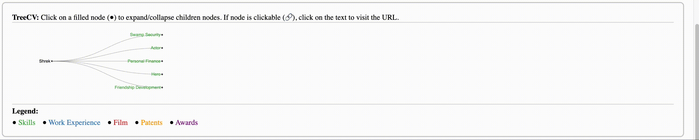
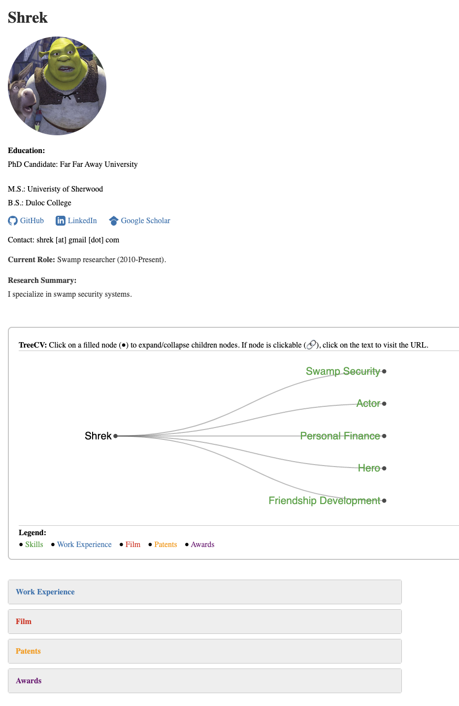

# TreeCV
Use this template to transform your resume or CV into an interactive hierarchical tree.



### Why use a TreeCV?
TreeCV is a skills-first presentation of your resume or CV that allows others
to understand your skillset in an instant and then explore concrete evidence of your skills. 
Nodes on the tree are color-coded to differentiate skills and various types of evidence
(e.g., work experience, publications, projects). This template combines the best aspects 
of a traditional resume/CV with TreeCV by allowing you to list your education, overview, and experiences
with clean javascript.

Interact with a real example of TreeCV [here](https://blahner.github.io/treecv/treecv.html).

Here is what this template looks like:


### Customizing your TreeCV
Unless you are Shrek, you will spend most of your time editing profile.json.
Your name will be the root node, then from that root node you will define
children nodes. Those children nodes can also have children nodes etc.

Node:
```
{"name": "Swamp Security", "color": "green"}
```

Node with children:
```
{"name": "Swamp Security", "color": "green",
    "children": [
        {
            "name": "Security Specialist, MySwamp and Co.", "size": 1000, "color": "blue",
            "children": [
            {"name": "What are you doing in my swamp?!", "url": "https://www.youtube.com/watch?v=CVf9Ail2pY0", "size": 3812},
            {"name": "Advanced Torch & Pitchfork Deterrence", "size": 1000},
            {"name": "Territorial Roaring", "size": 1000}
            ]
        }
    ]
}
```
See in the above example your node can also have links by specifying a "url" field.
Many nodes have a "size" field that is not currently used but I left it in because the javascript
can be edited to use "size" to customize the size of the node.

The main limitation of TreeCV is the length of the text ("name") that accompanies each node
is fairly limited. Or maybe it's a feature that forces you to be concise?

### Dependencies
This project is all html/css/javascript that runs client side. TreeCV repurposes the very nice collapsible tree from [D3](https://observablehq.com/@d3/collapsible-tree).
